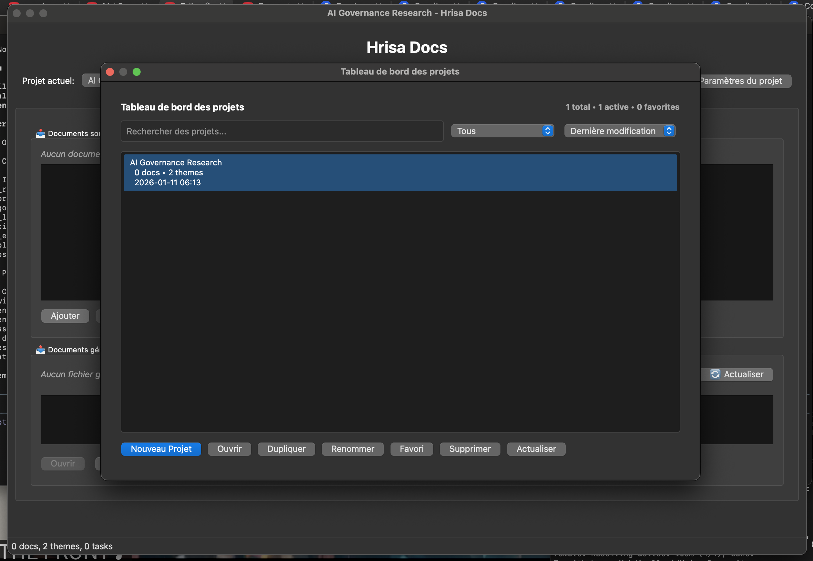
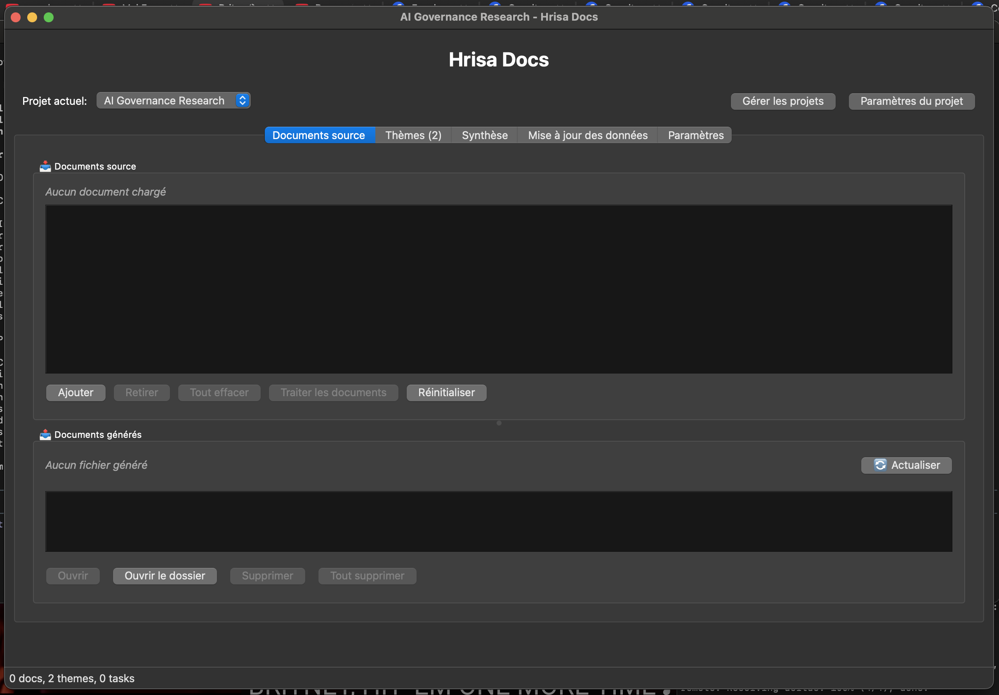
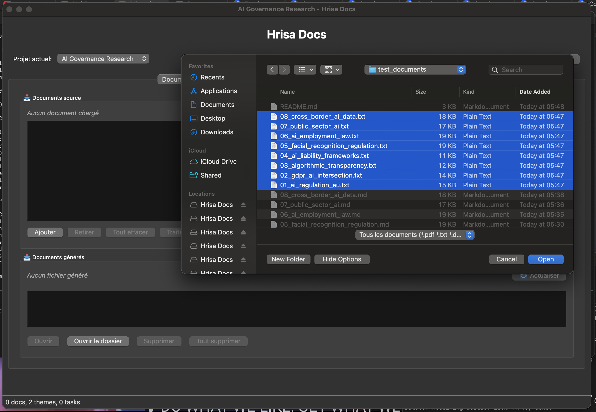
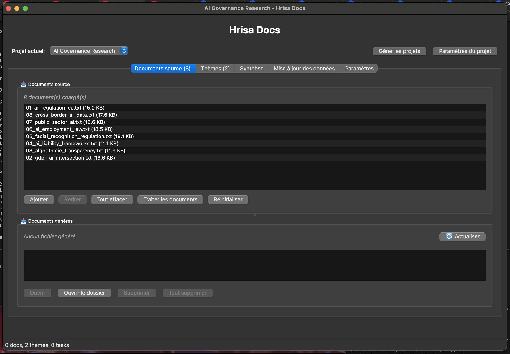
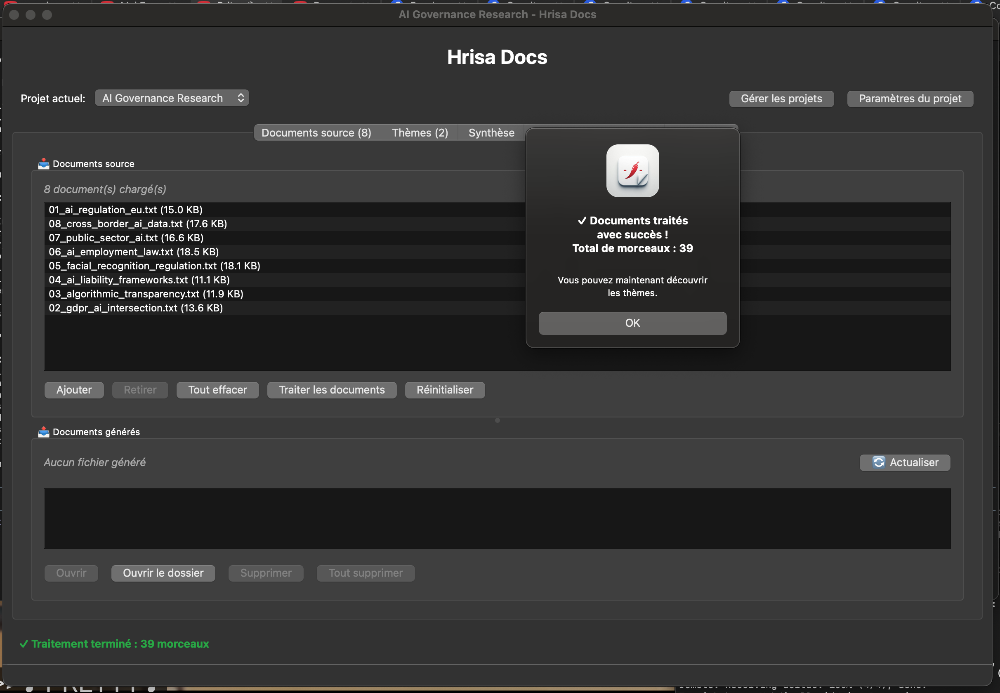
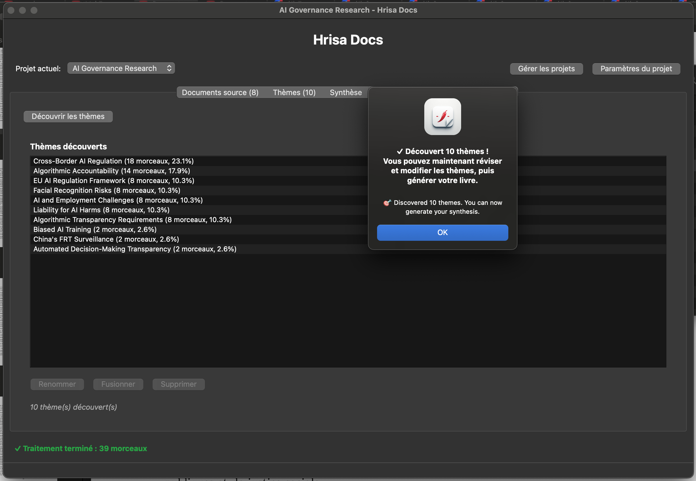
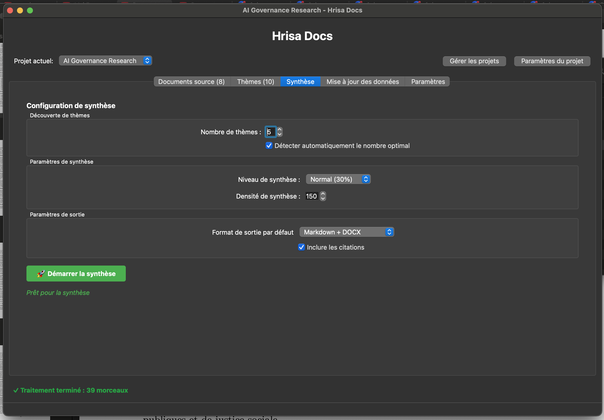
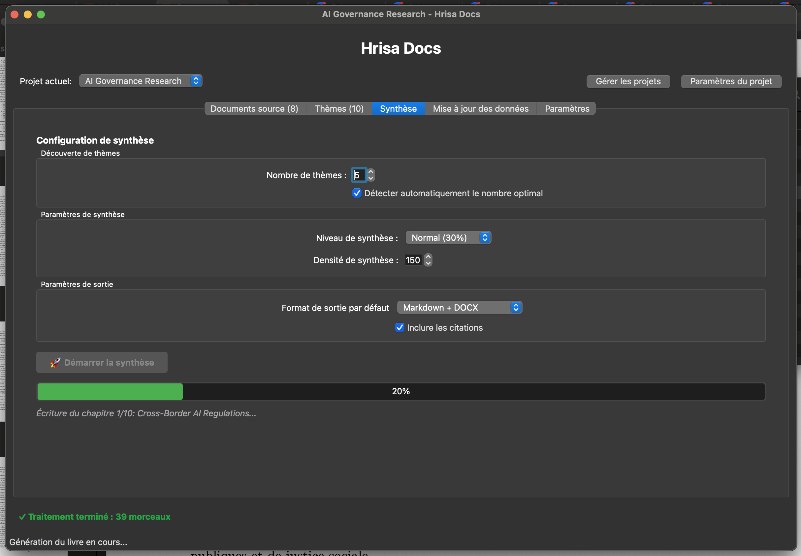
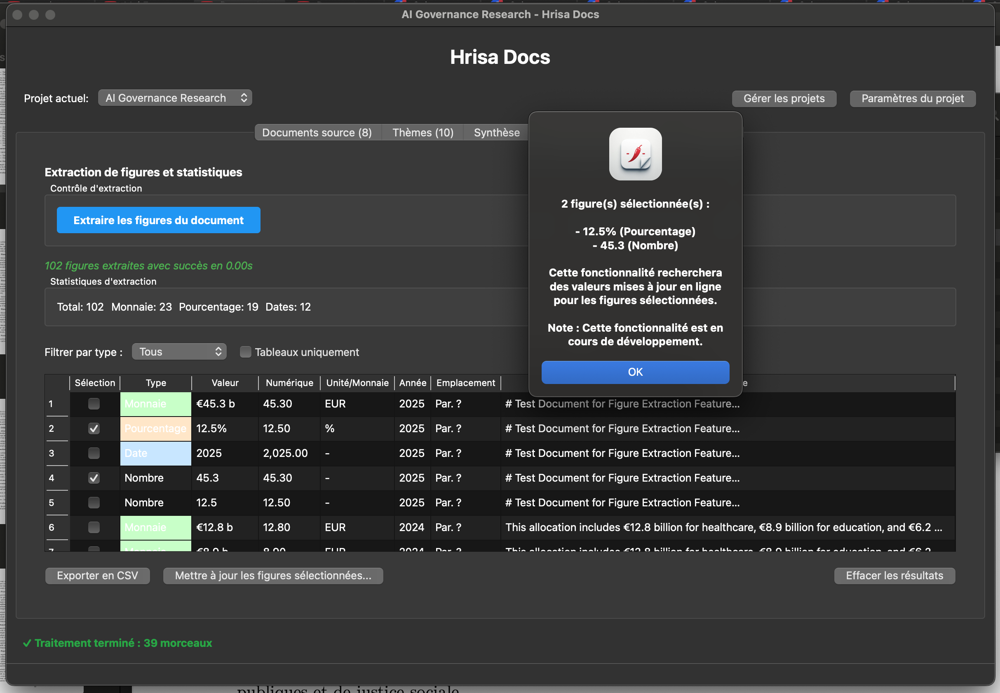
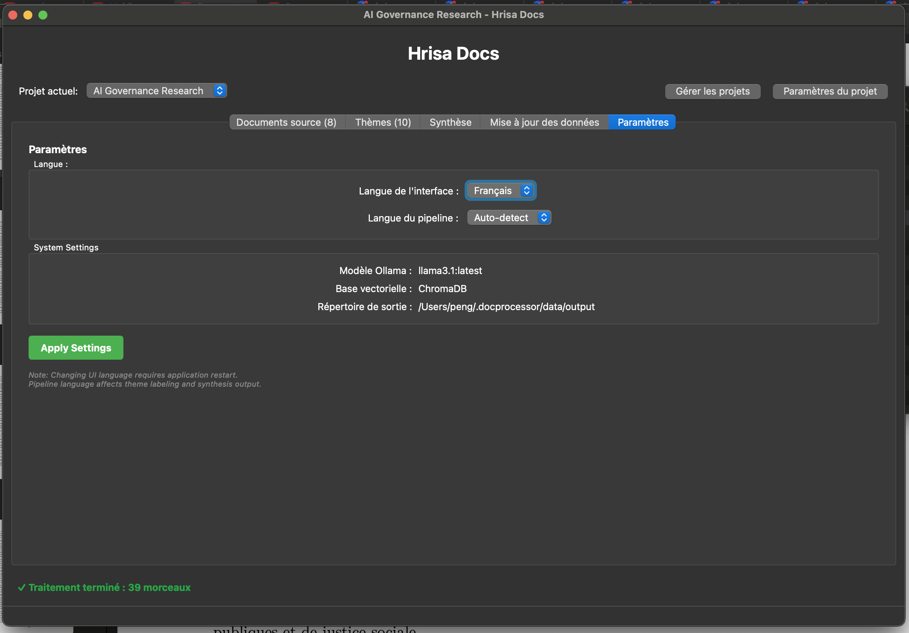

# Hrisa Docs


A powerful desktop application for researchers to consolidate publications and documents into synthesized books using RAG (Retrieval-Augmented Generation) with local LLMs.

## Features

### Core Capabilities
- **Document Processing**: Import PDFs, DOCX, TXT files with automatic text extraction
- **Semantic Search**: Vector-based search using state-of-the-art embeddings
- **Theme Discovery**: Automatic identification of major themes across documents
- **Intelligent Synthesis**: Generate coherent chapters from multiple sources
- **Citation Tracking**: Maintain references to source documents

### User Experience
- **Modern GUI**: Professional PyQt6 interface with dark/light themes
- **Keyboard Shortcuts**: Full keyboard navigation (Cmd+O, Cmd+N, Cmd+, etc.)
- **Multi-Project Support**: Manage multiple projects with duplicate, rename, and bulk operations
- **Rich Notifications**: Visual feedback with success indicators and statistics
- **Context Menus**: Right-click for quick actions on projects and documents
- **Smart Badges**: Document and theme count badges in tabs
- **Accessibility**: Three size profiles (Small, Medium, Large) for different needs
- **Multilingual**: Support for French, English, and Arabic
- **Local Processing**: All data stays on your machine
- **Privacy First**: No cloud services, no data collection

## Screenshots

### Complete Workflow: From Documents to Synthesis

**1. Project Management Dashboard**



*Manage multiple research projects with quick statistics and easy navigation*

**2. Empty Project View**



*Clean interface ready for document import*

**3. Import Documents**



*Select multiple PDFs, DOCX, or TXT files to import*

**4. Documents Imported**



*All 8 legal research papers imported and ready for processing*

**5. Processing Complete**



*Documents processed and embedded for semantic search*

**6. Themes Discovered**



*Automatic theme discovery identified 10 major themes from AI governance research*

**7. Synthesis Configuration**



*Configure synthesis parameters: theme count, detail level, and output format*

**8. Synthesis in Progress**



*Real-time progress tracking during chapter generation*

**9. Figure Extraction (Bonus Feature)**



*Extract tables and statistics from source documents*

**10. Application Settings**



*Customize language, theme, LLM model, and system parameters*

## Installation

### For End Users (Recommended)

Download the pre-built installer for your platform from the [Releases](../../releases) page.

#### macOS

1. **Download**: `HrisaDocs-0.1.0-macOS.dmg`
2. **Install**: Double-click the DMG file
3. **Drag**: Drag "Hrisa Docs.app" to Applications folder
4. **Run**: Open from Applications or Spotlight search
5. **Security**: If macOS blocks the app, right-click → Open (first time only)
   ```bash
   # Or remove quarantine flag via terminal:
   xattr -d com.apple.quarantine "/Applications/Hrisa Docs.app"
   ```

**Requirements**: macOS 12.0 (Monterey) or later

#### Linux (Ubuntu/Debian)

1. **Download**: `hrisa-docs-0.1.0-linux-x86_64.tar.gz`
2. **Extract**:
   ```bash
   tar -xzf hrisa-docs-0.1.0-linux-x86_64.tar.gz
   cd hrisa-docs
   ```
3. **Install** (optional, installs to /opt and creates desktop entry):
   ```bash
   sudo ./install.sh
   ```
4. **Run**:
   ```bash
   # If installed:
   hrisa-docs

   # Or run directly:
   ./hrisa-docs
   ```

**Requirements**:
- Ubuntu 22.04 or later
- Debian 11 or later
- Other Linux distributions with compatible glibc

#### Windows

**Note**: Windows installers are currently built using GitHub Actions or natively on Windows. Docker builds on ARM64 (Apple Silicon) are not yet supported.

1. **Download**: `HrisaDocs-0.1.0-Setup.exe` (from Releases)
2. **Install**: Double-click the installer and follow the prompts
3. **Run**: Launch from Start Menu or Desktop shortcut

**Requirements**: Windows 10 or later

### Prerequisites (All Platforms)

Hrisa Docs requires **two dependencies** to function properly:

1. **Ollama** - Required for AI-powered synthesis (LLM integration)
2. **Pandoc** - Optional, required only for PDF export

---

#### 📦 Ollama Installation (Required)

Ollama runs the local AI models that power document synthesis and theme labeling.

**macOS:**

1. **Download**: Visit [https://ollama.ai/download](https://ollama.ai/download)
2. **Install**: Download and open the macOS installer
3. **Verify**:
   ```bash
   ollama --version
   ```
4. **Pull Model**:
   ```bash
   ollama pull llama3.1:latest
   ```
   *(Downloads ~4.8 GB model, takes a few minutes)*

**Windows:**

1. **Download**: Visit [https://ollama.ai/download](https://ollama.ai/download)
2. **Install**: Download and run `OllamaSetup.exe`
3. **Verify**: Open Command Prompt (cmd) and run:
   ```cmd
   ollama --version
   ```
4. **Pull Model**:
   ```cmd
   ollama pull llama3.1:latest
   ```
   *(Downloads ~4.8 GB model, takes a few minutes)*

**Linux (Ubuntu/Debian):**

1. **Install via script**:
   ```bash
   curl -fsSL https://ollama.ai/install.sh | sh
   ```
2. **Verify**:
   ```bash
   ollama --version
   ```
3. **Pull Model**:
   ```bash
   ollama pull llama3.1:latest
   ```
   *(Downloads ~4.8 GB model, takes a few minutes)*

**Test Ollama:**

```bash
# Check if Ollama is responding
curl http://localhost:11434/api/tags

# Or test with a simple prompt
ollama run llama3.1:latest
>>> Hello
(Should respond with generated text)
>>> /bye
```

**System Requirements for Ollama:**
- **RAM**: 8 GB minimum (16 GB recommended)
- **Disk**: 5 GB for model storage
- **CPU**: Modern x86_64 or ARM64 processor

---

#### 📄 Pandoc Installation (Optional - For PDF Export)

Pandoc converts generated documents to PDF format. **Only needed if you want to export as PDF**.

**macOS:**

1. **Option A - Homebrew** (Recommended):
   ```bash
   brew install pandoc
   ```

2. **Option B - Installer**:
   - Visit [https://pandoc.org/installing.html](https://pandoc.org/installing.html)
   - Download macOS `.pkg` installer
   - Double-click to install

3. **Verify**:
   ```bash
   pandoc --version
   ```

**Windows:**

1. **Download**: Visit [https://pandoc.org/installing.html](https://pandoc.org/installing.html)
2. **Install**: Download and run `pandoc-3.x.x-windows-x86_64.msi`
3. **Verify**: Open Command Prompt (cmd) and run:
   ```cmd
   pandoc --version
   ```

**Linux (Ubuntu/Debian):**

1. **Install via apt**:
   ```bash
   sudo apt update
   sudo apt install pandoc
   ```

2. **Or install latest version**:
   - Visit [https://pandoc.org/installing.html](https://pandoc.org/installing.html)
   - Download `.deb` file for your architecture
   - Install:
     ```bash
     sudo dpkg -i pandoc-*.deb
     ```

3. **Verify**:
   ```bash
   pandoc --version
   ```

---

#### 🎨 LaTeX Distribution (Optional - For PDF Export)

To generate **PDF output** from synthesis results, you need a LaTeX engine. This is **only required if you want PDF export** - Markdown and HTML formats work without it.

##### macOS

**Option A - Homebrew** (Recommended, ~300 MB):
```bash
brew install --cask mactex-no-gui
```

**Option B - Full MacTeX** (~4 GB, includes GUI tools):
```bash
brew install --cask mactex
```

**Option C - Manual Install**:
1. Visit [https://www.tug.org/mactex/mactex-download.html](https://www.tug.org/mactex/mactex-download.html)
2. Download `MacTeX.pkg` (full) or `BasicTeX.pkg` (minimal)
3. Double-click to install

**Verify**:
```bash
xelatex --version
```

##### Windows

**Recommended: MiKTeX** (~200 MB base install, auto-installs packages on-demand)

1. **Download**: Visit [https://miktex.org/download](https://miktex.org/download)
2. **Install**:
   - Download the **Windows installer** (e.g., `basic-miktex-24.1-x64.exe`)
   - Run the installer
   - Choose "Install MiKTeX for all users" (requires admin) or "Only for me"
   - Select automatic package installation: **"Yes"** (recommended)
   - Complete the installation wizard
3. **Update** (important for first-time setup):
   - Open **MiKTeX Console** (from Start Menu)
   - Click "Check for updates"
   - Click "Update now" to get the latest packages
4. **Verify**: Open Command Prompt (cmd) and run:
   ```cmd
   xelatex --version
   ```
   You should see version information like: `MiKTeX-XeTeX 4.x (MiKTeX 24.x)`

**First PDF Generation - Package Installation:**

When you generate your first PDF in Hrisa Docs, MiKTeX will display **"Package Installation"** dialogs for missing LaTeX packages.

**IMPORTANT:**
1. **Uncheck** "Always show this dialog" checkbox
2. Click **"Install"** to download the package
3. **Do NOT close the command window** - let it close automatically after installation completes
4. MiKTeX will install all required packages automatically (takes 30-60 seconds total)
5. PDF generation will complete once all packages are installed

**Common mistake:** Closing the command window manually before package installation completes will cause the synthesis to fail. Let the window close by itself.

After the first PDF generation, all required packages are cached and subsequent exports are instant. This is MiKTeX's **on-demand package installation** feature working as designed.

**Alternative: TeX Live for Windows** (~6 GB, includes all packages):

1. **Download**: Visit [https://www.tug.org/texlive/windows.html](https://www.tug.org/texlive/windows.html)
2. **Install**: Run `install-tl-windows.exe` (takes 1-2 hours)
3. **Verify**:
   ```cmd
   xelatex --version
   ```

**Troubleshooting Windows:**
- If `xelatex` is not found after installation, **restart your terminal** or computer
- MiKTeX auto-installs missing packages on first PDF generation (may take a few minutes)
- If you get "pdflatex not found", install MiKTeX Console → Packages → Install `xetex`

##### Linux (Ubuntu/Debian)

**Recommended: TeX Live XeTeX** (~200 MB):
```bash
sudo apt update
sudo apt install texlive-xetex texlive-fonts-recommended texlive-fonts-extra
```

**Full TeX Live** (~6 GB, all packages):
```bash
sudo apt install texlive-full
```

**Verify**:
```bash
xelatex --version
```

**Other Linux Distributions:**
- **Fedora/RHEL**: `sudo dnf install texlive-xetex`
- **Arch Linux**: `sudo pacman -S texlive-core`
- **openSUSE**: `sudo zypper install texlive-xetex`

---

#### ✅ LaTeX Verification

After installing a LaTeX distribution, test it:

```bash
# Create a test file
echo '\documentclass{article}\begin{document}Hello World\end{document}' > test.tex

# Compile to PDF
xelatex test.tex

# Check if PDF was created
ls test.pdf

# Clean up
rm test.*
```

If this succeeds, **Hrisa Docs PDF export will work!**

See [PDF Export Setup Guide](docs/PDF_EXPORT_SETUP.md) for detailed instructions and troubleshooting.

---

#### ⚡ Quick Verification

After installing dependencies, verify everything is ready:

```bash
# Check Ollama
ollama --version
ollama list  # Should show llama3.1:latest

# Check Pandoc (optional)
pandoc --version

# Test Ollama connectivity
curl http://localhost:11434/api/tags
```

**All set!** You're ready to run Hrisa Docs.

---

#### 🔄 Automatic Installation (Recommended)

Our installers can **automatically install these dependencies** for you:

- **Windows installer**: Check "Install required dependencies" during installation
- **Linux installer**: Run `sudo ./install.sh` after extracting
- **macOS**: Run `scripts/post_install_macos.sh` after installation

This automates Ollama and Pandoc installation, saving you time!

## Quick Start (For Developers)

### Development Setup

```bash
# Clone repository
git clone <repo-url>
cd Document-Processing

# Setup (installs dependencies and creates virtual environment)
make setup

# Run application
make run
```

### First Project in 5 Minutes

1. **Create Project**: Click "Manage Projects" → "New Project"
2. **Add Documents**: Go to "Source Documents" tab → Click "Add"
3. **Process**: Click "Process Documents" (wait ~30s per 100 pages)
4. **Discover Themes**: Go to "Themes" tab → Click "Discover Themes"
5. **Generate Book**: Go to "Synthesis" tab → Configure → "Start Synthesis"
6. **Export**: Find your book in the project folder!

📖 See [Quick Start Guide](docs/QUICKSTART.md) for detailed walkthrough.

## Documentation

### For Users
- **[Installation Guide](docs/INSTALLATION.md)**: Complete installation instructions for macOS and Windows
- **[Quick Start](docs/QUICKSTART.md)**: 5-minute getting started guide
- **[User Guide](docs/USER_GUIDE.md)**: Complete manual with all features
- **[Performance Guide](docs/PERFORMANCE.md)**: Benchmarks, optimization tips, and hardware recommendations
- **[Troubleshooting](docs/TROUBLESHOOTING.md)**: Common issues and solutions
- **[PDF Export Setup](docs/PDF_EXPORT_SETUP.md)**: Configure pandoc and XeLaTeX for PDF generation

### For Developers
- **[Development Guide](docs/DEVELOPMENT.md)**: Setup development environment and contribute
- **[Contributing Guide](CONTRIBUTING.md)**: Code style, commit conventions, and PR process
- **[Local CI/CD Pipeline](docs/LOCAL_CICD.md)**: Automated build, test, and release pipeline
- **[Packaging Guide](docs/PACKAGING.md)**: Create distributable versions
- **[Linux Build Guide](docs/LINUX_BUILD.md)**: Build for Ubuntu/Debian and other Linux distributions
- **[Windows Build Options](docs/WINDOWS_BUILD_OPTIONS.md)**: Build Windows executables (native, cloud VM, GitHub Actions)

## Architecture

```
+--------------------------------------------------+
|              GUI Layer (PyQt6)                   |
|   Document Manager | Themes | Synthesis          |
+------------------------+-------------------------+
                         |
+------------------------+-------------------------+
|  Application Core                                |
|  +----------------+  +------------------+        |
|  | Document       |  | RAG Pipeline     |        |
|  | Processor      |  |                  |        |
|  +-------+--------+  +--------+---------+        |
|          |                    |                  |
|  +-------v--------+  +--------v---------+        |
|  | Embedder       |  | Theme Analyzer   |        |
|  | (Transformers) |  | (Clustering)     |        |
|  +-------+--------+  +--------+---------+        |
+---------+--------------------+-------------------+
          |                    |
+---------v--------------------v-------------------+
|  Data Layer                                      |
|  ChromaDB | Ollama | File System                 |
+--------------------------------------------------+
```

## Technology Stack

- **GUI**: PyQt6 (native performance, cross-platform)
- **Vector DB**: ChromaDB (embedded, persistent)
- **Embeddings**: Sentence Transformers (all-MiniLM-L6-v2)
- **LLM**: Ollama + LangChain (local models)
- **PDF Processing**: PyMuPDF (fast, reliable)
- **Data Models**: Pydantic (type-safe)

## Performance

Benchmarked on typical hardware (M1 MacBook Pro, 16GB RAM):

| Operation | Speed | Notes |
|-----------|-------|-------|
| Text Chunking | ~25,700 chunks/sec | Very fast |
| Embedding Generation | 146 chunks/sec | Good for CPU |
| Vector Search | <1ms | Blazing fast |
| Vector Storage | 2,044 chunks/sec | Excellent |
| Theme Discovery | ~30-60 sec | For 100 documents |
| Chapter Synthesis | ~1-2 min | Per chapter |

**Processing Times:**
- Small corpus (10 PDFs): 5-10 minutes
- Medium corpus (50 PDFs): 30-45 minutes
- Large corpus (100 PDFs): 60-90 minutes

📊 See **[Performance Guide](docs/PERFORMANCE.md)** for detailed benchmarks, optimization tips, and hardware recommendations.

*Run `python scripts/profile_performance.py` to benchmark your hardware*

## Development

### Setup Development Environment

```bash
# Install with dev dependencies
make setup

# Run tests
make test

# Run specific test suite
pytest tests/unit/test_document_processor.py -v

# Format code
make format

# Clean build artifacts
make clean
```

### Project Structure

```
Document-Processing/
├── src/docprocessor/       # Application source
│   ├── core/               # Business logic
│   ├── gui/                # PyQt6 interface
│   ├── llm/                # LLM integration
│   ├── models/             # Data models
│   └── utils/              # Utilities
├── tests/                  # Test suite
│   ├── unit/               # Unit tests
│   └── integration/        # Integration tests
├── config/                 # Configuration
├── docs/                   # Documentation
├── scripts/                # Build & utility scripts
└── data/                   # Local data (gitignored)
```

### Testing

```bash
# All tests
pytest

# Unit tests only
pytest tests/unit/

# Integration tests
pytest tests/integration/

# With coverage
pytest --cov=docprocessor --cov-report=html
```

**Test Coverage**:
- Hrisa Docs: 11 tests ✓
- Embedder: 11 tests ✓
- Vector Store: 16 tests ✓
- Theme Analyzer: 17 tests ✓
- Integration: 5 tests ✓

## Distribution

### Automated Builds (CI/CD)

**GitHub Actions** builds installers automatically for both platforms:

```bash
# Create a release
git tag v0.1.0
git push origin v0.1.0

# GitHub Actions automatically:
# - Builds for macOS and Windows
# - Runs tests
# - Creates installers
# - Publishes to GitHub Releases
```

Download artifacts from:
- **GitHub Actions**: Repository → Actions → Select workflow run
- **Releases**: Repository → Releases (for tagged versions)

### Manual Builds

#### Native Builds (Recommended for Production)

**macOS**:
```bash
python scripts/build_macos.py
# Creates: dist/Hrisa Docs.app
# Creates: dist/HrisaDocs-0.1.0-macOS.dmg
```

**Windows** (requires Windows machine):
```bash
python scripts/build_windows.py
# Creates: dist/HrisaDocs.exe
# Creates: dist/HrisaDocs-0.1.0-Setup.exe
```

**Linux** (native build on Linux):
```bash
python scripts/build_linux.py
# Creates: dist/hrisa-docs/
# Creates: dist/install.sh
```

#### Docker Builds (Cross-Platform)

Build from any OS using Docker:

**All platforms** (interactive):
```bash
./scripts/build_all_docker.sh
```

**Linux only** (production-ready):
```bash
./scripts/build_with_docker.sh
# Creates: dist/hrisa-docs-0.1.0-linux-x86_64.tar.gz
```

**Windows** (experimental, uses Wine):
```bash
./scripts/build_windows_docker.sh
# Creates: dist/HrisaDocs-0.1.0-Windows.zip
# ⚠️ Use native builds for production
```

**macOS**: Docker builds not supported (Apple licensing). Use native build or GitHub Actions.

📚 See [Docker Builds Guide](docs/DOCKER_BUILDS.md), [Packaging Guide](docs/PACKAGING.md), [Building for Windows](docs/BUILDING_WINDOWS.md), and [Linux Build Guide](docs/LINUX_BUILD.md) for details.

## Keyboard Shortcuts

### File Operations
- **Cmd/Ctrl + O**: Import documents
- **Cmd/Ctrl + Shift + U**: Import from URL
- **Cmd/Ctrl + Shift + O**: Open file in default application
- **Cmd/Ctrl + Q**: Quit application

### Project Management
- **Cmd/Ctrl + N**: Create new project
- **Cmd/Ctrl + Shift + P**: Open project dashboard
- **Cmd/Ctrl + ,**: Project settings (when project is open)

### Navigation
- Use **Tab** to navigate between fields
- Use **Space** or **Enter** to activate buttons
- Use **Cmd/Ctrl + Tab** to switch between tabs

## Configuration

### Settings

Located at `~/.docprocessor/`

```
~/.docprocessor/
├── preferences.json       # User preferences
├── logs/                  # Application logs
└── projects/              # Project data
```

### Appearance

**Settings → Appearance**:
- **Themes**: Dark (default), Light
- **Size Profiles**: Small, Medium, Large
- **Language**: French, English, Arabic

### System Settings

**Settings → System**:
- Ollama model selection
- Chunk size and overlap
- Embedding model
- Synthesis parameters

## Troubleshooting

### Quick Fixes

**Application won't start?**
```bash
# macOS: Remove quarantine
xattr -d com.apple.quarantine "/Applications/Hrisa Docs.app"
```

**Ollama connection failed?**
```bash
# Check if Ollama is running
curl http://localhost:11434/api/version

# Start Ollama
ollama serve
```

**PDF export not working?**
```bash
# Install pandoc and XeLaTeX
brew install pandoc                    # macOS
brew install --cask mactex-no-gui      # macOS
```

📚 See **[Troubleshooting Guide](docs/TROUBLESHOOTING.md)** for comprehensive solutions to common issues.

## Requirements

### Runtime
- Python 3.11+
- 8GB RAM (16GB recommended)
- 2GB disk space (plus data storage)
- Ollama running locally

### Development
- All runtime requirements
- pytest, black, ruff
- PyInstaller (for packaging)

## Contributing

This is a research project. For issues or suggestions:
1. Check [User Guide](docs/USER_GUIDE.md) for solutions
2. Review existing issues
3. Provide detailed bug reports with logs

## Roadmap

### Completed
- [x] Linux/Ubuntu support (Docker-based build with tarball distribution)
- [x] macOS installer (DMG package)
- [x] Cross-platform build scripts

### In Progress
- [ ] .deb package for Debian/Ubuntu
- [ ] AppImage for universal Linux distribution

### Windows Build Status
- ✅ Build scripts ready (`scripts/build_windows.py`)
- ⚠️ Docker build not supported on ARM64 (Apple Silicon)
- 📚 See [Windows Build Options](docs/WINDOWS_BUILD_OPTIONS.md) for:
  - Native Windows build (recommended)
  - GitHub Actions (automated)
  - Cloud Windows VM (Oracle Cloud free tier, AWS, Azure, GCP)

### Planned Features
- [ ] OCR support for scanned PDFs
- [ ] Export to LaTeX, EPUB formats
- [ ] Custom fine-tuned models for legal domain
- [ ] Citation management (BibTeX export)
- [ ] Multi-language document processing

### Future Enhancements
- **CI/CD Pipeline**: Automated deployment pipeline with validation, testing, artifact generation, and release management
- CLI version for command-line workflows and automation
- Web version for browser-based access
- Snap/Flatpak packages for Linux app stores
- Cloud sync option (optional)
- Collaborative projects
- Advanced citation styles
- Plugin system for custom processors

## License

This project is licensed under the MIT License - see the [LICENSE](LICENSE) file for details.

## Acknowledgments

Built with:
- [PyQt6](https://www.riverbankcomputing.com/software/pyqt/) - GUI framework
- [ChromaDB](https://www.trychroma.com/) - Vector database
- [Sentence Transformers](https://www.sbert.net/) - Embeddings
- [Ollama](https://ollama.ai/) - Local LLM runtime
- [PyMuPDF](https://pymupdf.readthedocs.io/) - PDF processing

## Support

- **Documentation**: See `docs/` folder
- **Issues**: GitHub Issues
- **Logs**: `~/.docprocessor/logs/docprocessor.log`

---

**Made with 🤖 for Researchers**

Generate comprehensive books from your research papers automatically.
